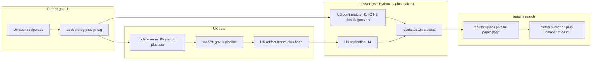

# Completing Paper #1: from draft prereg to published paper

## Where we are

Discovery is done: frozen GSA artifact (12,252 sites, hash pinned in [docs/research/paper-01-design-systems-a11y/PREREGISTRATION.md](docs/research/paper-01-design-systems-a11y/PREREGISTRATION.md)), explorer live, prereg **drafted but NOT LOCKED**, paper status "in progress". Missing: the UK replication data (H4), the actual confirmatory analysis (H1–H3 + 6 diagnostics), and the results write-up. The prereg's freezing protocol dictates the order — **UK recipe committed → prereg locked → scan → analysis → paper**.

## Phase 1 — UK scanner + frozen recipe (the binding pre-commitment)

**Recipe doc** `docs/research/paper-01-design-systems-a11y/UK_SCAN_RECIPE.md`, committed **before any scanning** (required by prereg §6):

- **Domain sources (broad scope, org_type fixed effects):** central government (GDS's published .gov.uk domains register CSV), local authorities (~400, mySociety `uk_local_authority_names_and_codes` with website URLs), NHS trusts/ICBs (NHS England lists), devolved (gov.scot, gov.wales, nidirect — best-effort). Source URLs + retrieval dates recorded; list snapshots committed to `data/raw/uk-domains/` inputs section (small CSVs, committed).
- **Page sampling:** homepage only, follow redirects, no interaction, scan state ~5s after load — mirrors GSA's primary-URL scan.
- **govuk-frontend detection score (USWDS-count analogue), fixed weights:** counts of `.govuk-`-prefixed classes, `data-module="govuk-*"` attributes, `govuk-frontend` asset paths + version strings (filename/CSS banner/`govuk-frontend-supported` class), GDS Transport font references, crown favicon. **Bands fixed structurally from score construction** (not tuned on data); a 50-site pre-declared calibration set (known adopters/non-adopters, excluded from analysis) verifies detection correctness only.
- **Outcome mapping:** axe-core WCAG A/AA rules mapped to GSA's category names (contrast, aria, images, link-purpose…) using GSA's published rule-to-category mapping; raw axe rule IDs also retained so the mapping is auditable.
- **Statuses + politeness:** GSA-style scan statuses (completed/timeout/dns_error/blocked), one page per site, ~8 concurrent, identifying user agent, robots.txt honoured (recorded as `blocked_robots`).

**Scanner** `tools/scanner` (TS, mirrors [tools/etl](tools/etl/src/gsa.ts) conventions): Playwright + axe-core injection, emits JSONL per site to gitignored `data/raw/uk-scan/`. Also collects covariates for H4 controls: HTTPS/HSTS headers, third-party request count, viewport meta, generator meta (CMS), best-effort LCP/CLS. Unit tests on HTML fixtures for the detection heuristics.

## Phase 2 — Lock the pre-registration

- Finalize §5 priors, set status **LOCKED** with date, re-verify artifact hashes, reference the recipe commit.
- Git tag `paper-01-prereg` pinning prereg + ETL + parquet.
- Flip paper status in [apps/research/src/content/papers.ts](apps/research/src/content/papers.ts) from `in-progress` to `preregistered` (status enum + badges already support this).

## Phase 3 — Run the scan, freeze the UK artifact

- Calibration pass (50 sites) → verify detection → full scan (~2,500–4,000 sites, est. 2–3 hours at 8 concurrent).
- New ETL pipeline `tools/etl/src/govuk.ts` → `data/processed/govuk_a11y.parquet` + `data/summaries/govuk-a11y.json` + app copies (same pattern as GSA). New schemas + `GOVUK_BANDS` in [packages/datasets/src/gsa.ts](packages/datasets/src/gsa.ts)'s sibling `govuk.ts`.
- `DATA_FREEZE.md` recording UK artifact hash + scan window; tag `paper-01-uk-data`.

## Phase 4 — Confirmatory analysis: `tools/analysis` (Python, uv + pyfixest)

- `pyproject.toml` (uv); deps: pyfixest, pandas, pyarrow, duckdb, scipy. Thin `package.json` so `vp run analysis#us` shells to `uv run`.
- `us_confirmatory.py`: H1 (PPML, agency FE, clustered SEs, IRRs), H2 (version contrast), H3 (category stacking + 2,000-draw cluster bootstrap), diagnostics 1–6 (adoption-on-maturity gradient, CLS/LCP placebos, pooled-vs-FE attenuation, Oster bounds implemented per the linear analogue, DAP subset, functional form).
- `uk_confirmatory.py`: H4 PPML with org-type FE + the US-vs-UK IRR comparison window (±0.20).
- Outputs: `data/results/paper-01/*.json` validated against new Zod results schemas in `packages/datasets`, copied into `apps/research/src/generated/` for build-time import. Smoke test on a synthetic mini-dataset.

## Phase 5 — Write and publish the paper

- Extend `/papers/$slug` with a slug-keyed content component (same registry pattern as the explorer): full sections — Introduction, Data, Methods, Results, Diagnostics & robustness, UK replication, Limitations, **Deviations from pre-registration appendix**, Downloads (both Parquets, results JSON, prereg).
- Results figures (Observable Plot, fed by results JSON at build time): adjusted IRR forest plot, unadjusted-vs-adjusted band gradient, category-specificity dot plot, US-vs-UK replication comparison.
- Generalize [apps/research/src/components/uswds-explorer.tsx](apps/research/src/components/uswds-explorer.tsx) into a band-config-driven explorer so the UK dataset gets `/explore/govuk-a11y` nearly for free; register it in [apps/research/src/content/datasets.ts](apps/research/src/content/datasets.ts).
- Rewrite the abstract around the confirmatory results (whatever they are — nulls reported as nulls per prereg), flip status to `published`, update the portfolio blurb in [apps/website/src/routes/index.tsx](apps/website/src/routes/index.tsx), final `vp check` + builds + browser pass.

## Phase 6 (optional, exploratory)

HTTP Archive triangulation: one free-tier BigQuery extract (UI-library detection × Lighthouse accessibility) rendered as a clearly-labelled exploratory section. Does not gate the paper (only H1 + H4 do).

## Risks to manage

- **Council CMS noise:** platforms like Jadu embed partial govuk styles — the structural score + auditable raw signals keep this honest; noted in limitations.
- **Cookie banners:** scanned as-landed (pre-declared), same as GSA.
- **PPML separation under FE:** log-linear OLS fallback already pre-registered as a functional-form diagnostic.
- **H4 magnitude window** may fail even if direction replicates — the prereg already defines how that's reported.
