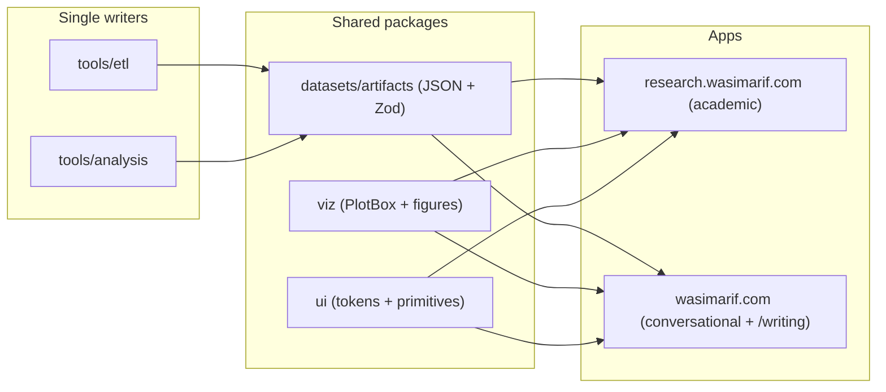

# Personal site: architecture, blog, and the first post

## Where things stand

[apps/website](apps/website/src/routes/index.tsx) is one long page plus an `/openfgc` case study. No header or footer, raw `gray-*` classes, a Writing section whose only entry links to `#`, and `body { font-family: Arial }` overriding Geist in [styles.css](apps/website/src/styles.css). The research app has everything the blog wants to reuse, but it is trapped there: Observable Plot figures in [paper-figures.tsx](apps/research/src/components/paper-figures.tsx) and validated results JSON in `apps/research/src/generated/`.

## Architecture: share via packages, not copies

Two extractions make the blog (and any future app) cheap:

- **`packages/viz`** (new): `PlotBox` (the client-only Plot loader), the plot theme, and the generic figures (`ForestPlot`, `BandGradient`, `UsUkComparison`, `CategoryDotPlot`) move here from the research app. Research imports them back; blog figures build on the same `PlotBox`. Depends on `@observablehq/plot` + react.
- **`packages/datasets/artifacts/`** (new export `datasets/artifacts`): the figure-grade JSON (uswds + govuk summaries, us + uk confirmatory results) moves here as the single committed copy, parsed once with the existing Zod schemas and exported typed. Writers update: `GENERATED_DIR` in [tools/analysis/common.py](tools/analysis/common.py) and the `webSummary` targets in [tools/etl/src/govuk.ts](tools/etl/src/govuk.ts) / `gsa.ts` point at the package; `apps/research/src/generated/` is deleted and [paper-01-results.ts](apps/research/src/content/paper-01-results.ts) / [papers.ts](apps/research/src/content/papers.ts) become thin re-exports. Parquet web copies stay in `apps/research/public/data/` (the explorer serves them over HTTP).

## Website shell

- `SiteHeader` (website variant of the research one): wordmark, nav links Writing (`/writing`) and Research (`https://research.wasimarif.com`, presented as a first-class section of the site, not a footnote). `SiteFooter`: socials, email, source link. Both mounted in [\_\_root.tsx](apps/website/src/routes/__root.tsx) so every route gets them.
- Fix the body font to Geist, adopt the `ui` token classes (`text-ink-muted`, `border-edge`) on everything we touch so both apps share one design language. The black background, metallic logo, and emerald accent stay.

## Blog: custom TSX posts, no CMS

Markdown would cap what posts can do visually, so each post is a React component, same registry pattern as the research paper page:

- `apps/website/src/content/posts.ts`: `PostMeta` (slug, title, deck, date, reading time, tags) driving the index and homepage.
- `apps/website/src/components/posts/post-registry.tsx`: slug to component map.
- Routes `writing.tsx` (index list) and `writing.$slug.tsx` (loader + notFound + per-post `head()` with description and OG tags), rendering the body inside a `PostLayout` (title block, date, reading time, back link, dig-deeper footer).
- Post primitives in `apps/website/src/components/posts/`: `PostProse` (blog typography on top of the ui `Prose`), `Figure` (chart + caption), `StatRow` (big numbers), `Callout` (asides), `LinkCard` (the "read the actual paper" CTA).

The homepage Writing section lists real posts from the registry; the dead "design tokens" placeholder entry is removed.

## First post: the Paper 1 story for engineers

`/writing/design-systems-accessibility`, working title "Do design systems actually deliver on accessibility?". Same facts as the paper, none of the register. Voice rules for all new copy: first person, contractions, short sentences, concrete verbs, no em-dashes anywhere, no "delve/dive in/game-changer" filler, honest hedging in plain words ("this is a correlation, and here is how I tried to break it").

Structure and figures (data from `datasets/artifacts`, charts from `viz`):

1. The promise everyone repeats: pick a design system, get accessibility for free. Nobody had checked at scale, so I did.
2. What I measured, in one breath: 12,252 US federal sites GSA scans daily (adoption score + axe-core violations), then 8,136 UK public sector sites I scanned myself in an afternoon. **Figure: violations by adoption band** (friendly labels, from the uswds summary).
3. The headline: heavy adopters show about half the detected violations once you compare like with like. Plain-English version of agency fixed effects and the maturity controls. **StatRow: -50% US, -44% UK, 18k+ sites.**
4. Could it just be better teams? The three checks that say not entirely (same-agency comparison, performance placebos, how little the estimate moved), each in one conversational sentence.
5. The UK twist: rules written down and locked before scanning, run once. It held. **Figure: US vs UK comparison with the agreed window.**
6. What did not go the way I expected: v3 no better than v2, the weird UK partial band (CMS sprinkles of govuk classes), category predictions that missed. Said plainly, framed as the interesting part.
7. What I would actually do with this as an engineer, three short takeaways.
8. Dig deeper: `LinkCard` to the full paper at research.wasimarif.com (plus prereg, data explorers, raw downloads), making the research app the canonical home for the rigorous version.

## Homepage copy pass

Rewrite the hero, project blurbs, and Research section in the same voice (the current research blurb I wrote earlier is full of em-dashes and reads like a press release). Research app copy stays academic on purpose; this pass only touches the website.

## Verification

`vp check` + `vp test`, both app builds (research must still build after the artifact move), then a browser pass: homepage, /writing, the post (figures render, links to the research app resolve), and the research paper page still rendering from the relocated artifacts.
