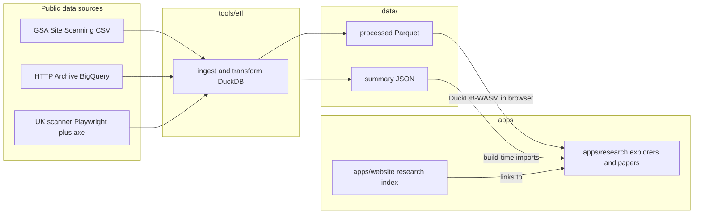

# Research Platform: Design Systems × Accessibility

## Direction (decided)

Lead with an **observational paper on public data** — _"Do design systems deliver accessibility at scale?"_ — followed by the **PatternLock agent benchmark** as paper #2. Web presence: **new `apps/research` app** in the monorepo with its own subdomain; the portfolio gets a light `/research` index; both apps share a new `packages/ui` design system.

## Key research findings (to be written up in the findings doc)

- **GSA Site Scanning** (US): bulk daily CSV/JSON for ~26k federal sites with graded USWDS adoption signals (`uswds_count`, semantic version) _and_ axe-core violation counts. No published study links the two — open niche, zero data cost.
- **HTTP Archive BigQuery**: Wappalyzer technology detection joinable with Lighthouse accessibility scores, millions of pages monthly. Use pre-aggregated tech-report tables to stay in the free tier.
- **UK replication gap**: GDS claims GOV.UK Design System "gets you to WCAG 2.2 faster" (1,200+ services) but publishes no raw data. We build our own scanner (Playwright + axe-core + `govuk-frontend` detection over public-sector domains) — novel data we create, and the held-out replication in the Mollick pre-registration style ([docs/PREREGISTRATION.md](docs/PREREGISTRATION.md) is the template).
- **Experiment gap confirmed**: existing evals are static-HTML a11y generation (microsoft/a11y-llm-eval) or JS bug-fixing (SWE-bench Multimodal); none measure design-system adherence by agents inside real product codebases → PatternLock (paper #2) remains novel. `packages/ui` later becomes the benchmark's reference design system (dogfooding story).

## Architecture

## Monorepo layout (extends existing `pnpm-workspace.yaml` slots)

- `apps/research` — new TanStack Start app (same stack as [apps/website](apps/website/vite.config.ts): React 19, Tailwind 4, catalog deps). Routes: `/` (lab index), `/papers/$slug` (paper layout: abstract, figures, methods, pre-registration link), `/explore/$dataset` (interactive explorers). Adds `@duckdb/duckdb-wasm` + Observable Plot — heavy deps isolated from the portfolio.
- `packages/ui` — minimal shared design system: design tokens (CSS variables + Tailwind theme), `Card`, `Section`, `Prose`, `DataTable`, chart wrapper. Consumed by both apps; later the PatternLock reference DS.
- `packages/datasets` — typed access layer: Zod schemas for each dataset, loaders for Parquet/JSON artifacts, shared metric definitions.
- `tools/etl` — TS scripts (run via `vp run`): download GSA snapshot, transform with DuckDB (node) to Parquet + JSON summaries. Later: HTTP Archive extract, npm/GitHub panels.
- `tools/scanner` — phase 2: UK public-sector scan (Playwright + axe-core + govuk-frontend heuristics).
- `data/` — `raw/` gitignored; `processed/` (Parquet, a few MB) and `summaries/` (JSON) committed for reproducibility. Move to object storage only if artifacts outgrow git.
- `docs/research/paper-01-design-systems-a11y/` — PREREGISTRATION.md, methods notes, deviations appendix.

## Data layer decision

Static **data-artifacts pattern**, no database: ETL emits versioned Parquet/JSON; the research app queries Parquet client-side via DuckDB-WASM for free-form exploration and imports precomputed JSON for paper figures at build/SSR time. Reproducible, zero hosting cost, fits pre-registration discipline (frozen artifacts = frozen analysis inputs). A real DB (e.g. Convex) only enters later if we collect user-generated data (votes, annotations) or live benchmark runs.

## Paper #1 sketch (full version goes in the findings doc + prereg)

- H1: dose–response — higher `uswds_count` predicts fewer axe-core violations per page, controlling for agency, site size/complexity.
- H2: newer USWDS semantic versions predict fewer violations.
- H3: held-out replication — frozen specification applied to our own UK govuk-frontend scan.
- Confounds to pre-register: agency digital maturity (use Digital Analytics Program participation as a control), page complexity, monorepo-style shared infrastructure across sites.

## Execution order

1. Findings doc (the requested deliverable) → 2. scaffold `packages/ui` + `apps/research` + portfolio index → 3. GSA ETL + `packages/datasets` → 4. first explorer (USWDS adoption × a11y violations) → 5. pre-registration draft. Phase 2 (after this plan): HTTP Archive extract, UK scanner, analysis + paper site. Phase 3: PatternLock benchmark harness reusing the same data/artifact pipeline.
