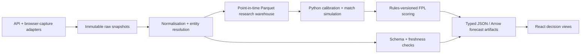

# FPL Market Intelligence: research and app experiment brief

- **Date:** 16 July 2026
- **Status:** exploratory research for a private, non-commercial side project; not a data-licensing or legal opinion
- **Scope:** using football betting and prediction-market signals to estimate Fantasy Premier League (FPL) player points, then making those estimates explorable through useful, distinctive web interfaces

## How to read this brief

- **Verified fact** means the statement is supported by a linked primary source.
- **Inference** means it is an interpretation of those facts and should be tested.
- **Recommendation** means it is a product or technical choice proposed for this project.

For this brief, technical reachability is enough to make a source a prototype candidate. Source terms still matter as warnings about breakage, account action, and future publishability, but they are **not a gate for this private experiment**. This plan uses public endpoints, public page data, and the creator's own authenticated access where needed; it does not depend on defeating authentication, CAPTCHAs, paywalls, geo-controls, or other access controls.

An odds-shaped number is also not automatically a calibrated probability: bookmaker margin, exchange spread, commission, liquidity, staleness, and settlement rules all affect its meaning.

## Executive recommendation

The underlying product idea is strong: market prices contain compact, continuously updated beliefs about match and player outcomes, while FPL turns those outcomes into a rich decision problem involving minutes, scoring rules, squad constraints, transfers, captaincy, and multiple gameweeks. The most useful product would not be an odds screen. It would be an **uncertainty-aware FPL decision tool** that explains how market evidence changes a player's forecast and the choices that follow from it.

The clarified private-experiment scope changes the centre of gravity. Instead of beginning with synthetic data and a static ranking table, begin collecting real point-in-time snapshots immediately. A multi-source archive makes **movement, disagreement, and replay** first-class material, so the most compelling headline is now a **Deadline Intelligence Room / Gameweek Time Machine**: scrub through the 48 hours before an FPL deadline and watch market moves propagate into player-point distributions, captaincy, and transfer recommendations.

The revised product order is:

1. **Deadline Intelligence Room / Gameweek Time Machine** — the primary shell, combining quote movement, source disagreement, news annotations, forecast revisions, and a time scrubber;
2. **Opportunity Map** — market-implied points versus FPL price and ownership, exposing attractive differentials and crowded picks. Use the stronger name “Market Edge Map” only after backtests demonstrate a repeatable edge;
3. **Transfer Multiverse** — a combined Frontier, Scenario Lab, Regret Board, and Route Map for comparing moves across the same simulated gameweek futures;
4. **Forecast Ledger** — essential exact-reading infrastructure, now embedded in the room rather than treated as the distinctive headline;
5. **Odds-to-Points Recipe** — a universal explanation drawer for every player, move, and historical change;
6. **Cross-Market Tension Graph and Match-State Lattice** — the more experimental visual showcases, fed by real replay data and always paired with exact 2D views.

This is a real change from the initial ranking. With only a small, static, carefully curated dataset, Ledger and Frontier offer the most value. With frequent snapshots from many sources, temporal replay and cross-market disagreement are both more novel and more informative.

Keep the experience explicitly about FPL decisions. Do not include bet placement, affiliate calls to action, or language that implies certainty. Market data is evidence for a forecast, not a recommendation to gamble.

## What market data can add

FPL forecasts are usually built from historical player output, expected goals/assists, fixtures, and projected minutes. Betting markets add several useful signals:

- a time-sensitive team-strength prior from match winner, handicap, and goal-total markets;
- clean-sheet and expected-goal information from both-teams-to-score, team totals, and correct-score markets;
- player event signals from anytime scorer, assist, shot, save, and card markets where available;
- disagreement and uncertainty information from bid/ask spread, depth, source dispersion, and price movement;
- news reaction: line-up, injury, weather, and tactical information may be reflected in prices before a manually maintained projection is updated.

**Inference:** the largest incremental value is likely to come from combining broad match markets with an independent minutes/starting model. A short-priced anytime scorer who is unlikely to start is not a high expected-points asset; a reliable 90-minute defender's clean-sheet value also depends on goal timing because FPL clean sheets require at least 60 minutes.

The target should be a **full player-points distribution**, not one expected-points number. FPL decisions depend differently on median outcome, downside, explosive upside, correlations, and multiweek opportunity cost.

## Capture-first data acquisition

For this experiment, optimise for **time to the first reproducible archive**, not for a perfect provider contract. Use one adapter interface regardless of how a source is collected, and work down this acquisition ladder:

1. **Direct JSON, REST, or WebSocket.** Prefer documented APIs, then stable observable JSON endpoints. Preserve response headers and the original payload.
2. **Observed page network traffic.** If a public page has the data but no public API, inspect its normal XHR, `fetch`, GraphQL, or WebSocket responses in the browser and capture the response the page itself consumes.
3. **Embedded page state.** Parse JSON hydration objects or structured data included in the returned HTML.
4. **DOM parser.** Use Playwright to read rendered market groups and selections only when no structured response exists. Keep selectors isolated per source and retain a screenshot/HTML sample for parser tests.

Do not build around bypassing a login, CAPTCHA, paywall, geo-control, signed request, or other access control. If ordinary access stops at one of those boundaries, skip that source or use the project's own authorised session. Poll politely with jitter and backoff; cache fixture and market catalogues; pause on `429`/`403`; and make every adapter independently disposable.

### Practical source stack

| Priority | Source                                       | Acquisition route and useful data                                                                                                                                                                                                                                                                                                                                                                                                                                                                                                                                                                                                                                                                           | Prototype caveat                                                                                                                                                                                                                                                                                                                                                                                                                                                     |
| -------- | -------------------------------------------- | ----------------------------------------------------------------------------------------------------------------------------------------------------------------------------------------------------------------------------------------------------------------------------------------------------------------------------------------------------------------------------------------------------------------------------------------------------------------------------------------------------------------------------------------------------------------------------------------------------------------------------------------------------------------------------------------------------------- | -------------------------------------------------------------------------------------------------------------------------------------------------------------------------------------------------------------------------------------------------------------------------------------------------------------------------------------------------------------------------------------------------------------------------------------------------------------------- |
| **A**    | **FPL**                                      | Poll the observable [`bootstrap-static`](https://fantasy.premierleague.com/api/bootstrap-static/) and [`fixtures`](https://fantasy.premierleague.com/api/fixtures/) JSON; add `/api/element-summary/{player_id}/` for history/fixtures and `/api/event/{gameweek}/live/` for live points and BPS. These expose player prices, status, expected-stat fields, set pieces, minutes, events, and scoring inputs. Use the creator's own session only for any account-specific endpoint.                                                                                                                                                                                                                          | Undocumented contracts can change without notice, so snapshot raw payloads and validate schemas. The [FPL terms, paragraphs 28–29](https://fantasy.premierleague.com/help/terms) make automated extraction a terms risk, but this is an access-fragility note rather than a project gate.                                                                                                                                                                            |
| **A**    | **The Odds API**                             | The fastest bookmaker baseline: one API key, `soccer_epl`, UK/EU regions, normalised bookmaker IDs, timestamps, current 1X2/totals, event-market discovery, and paid point-in-time history through `/v4/historical/...` ([v4 guide](https://the-odds-api.com/liveapi/guides/v4/), [EPL coverage](https://the-odds-api.com/sports-odds-data/epl-odds.html)). Start with a trial before writing individual bookie parsers.                                                                                                                                                                                                                                                                                    | It does not remove the need for source adapters: the documented bookmaker list/coverage is dynamic, bet365 is not currently a dependable inclusion, and soccer player props are much thinner than core match markets. Historical snapshots and additional markets require a paid tier.                                                                                                                                                                               |
| **A**    | **Polymarket**                               | Use public Gamma/Data/CLOB REST endpoints for discovery, books, prices, and history, plus the market WebSocket for live changes ([API introduction](https://docs.polymarket.com/api-reference/introduction), [market-data overview](https://docs.polymarket.com/market-data/overview), [market channel](https://docs.polymarket.com/market-data/websocket/market-channel)). The schema includes scorer, assist, save, goal, and goal-plus-assist soccer market types ([sports market types](https://docs.polymarket.com/api-reference/sports/get-valid-sports-market-types)); on-chain history is a second reconstruction route ([blockchain data](https://docs.polymarket.com/resources/blockchain-data)). | Coverage and liquidity will be intermittent. Keep it read-only; Great Britain is blocked for order placement ([geoblock documentation](https://docs.polymarket.com/api-reference/geoblock)).                                                                                                                                                                                                                                                                         |
| **A/B**  | **Betfair Exchange**                         | Use the delayed API for catalogue/price experiments, Streaming API when accessible, and the downloadable historical service for timestamped price, market, and settlement replay ([developer site](https://developer.betfair.com/), [market catalogue](https://betfair-developer-docs.atlassian.net/wiki/spaces/1smk3cen4v3lu3yomq5qye0ni/pages/2687517/listMarketCatalogue), [market book](https://betfair-developer-docs.atlassian.net/wiki/spaces/1smk3cen4v3lu3yomq5qye0ni/pages/2687510/listMarketBook), [historical coverage](https://support.developer.betfair.com/hc/en-us/articles/360002407732-What-data-is-provided-by-the-Historical-Data-service)).                                            | Keys/accounts add setup time and live activation currently costs £499 ([access costs](https://support.developer.betfair.com/hc/en-us/articles/115003864531-Are-there-any-costs-associated-with-API-access)). Delayed access is enough for adapter development; [read-only](https://support.developer.betfair.com/hc/en-us/articles/25033076334748-What-is-read-only-Betfair-API-access) and licensing policies are maintenance/account risks for continuous capture. |
| **B**    | **Smarkets Exchange**                        | The exchange's approved API covers events, markets, contracts, quotes, volume, and executions ([API docs](https://docs.smarkets.com/)); public football event pages show unusually useful scorer, assist, shots, cards, saves, and other props ([example EPL event](https://smarkets.com/event/44484182/sport/football/england-premier-league/2025/08/18/19-00/leeds-united-vs-everton)). Try the API; otherwise apply the capture ladder to a public event page. Its separate fantasy-football points markets can be a conditional benchmark ([rules](https://help.smarkets.com/hc/en-gb/articles/12807188772893-35-Fantasy-football-rules)).                                                              | API approval and a £150 fee add friction, while the [API terms](https://help.smarkets.com/hc/en-gb/articles/34697834941085-Smarkets-API-Access-Integration-T-Cs) create account risk for extraction-only use. Market settlement and FPL rules differ, especially non-starter voids.                                                                                                                                                                                  |
| **B**    | **Kalshi**                                   | Public REST endpoints expose markets, order books, historical trades, and candlesticks ([quick start](https://docs.kalshi.com/getting_started/quick_start_market_data), [order books](https://docs.kalshi.com/getting_started/orderbook_responses), [historical data](https://docs.kalshi.com/getting_started/historical_data)). A generic adapter is straightforward and useful whenever relevant football markets appear.                                                                                                                                                                                                                                                                                 | EPL/player-prop coverage is not dependable. The [developer agreement](https://kalshi-public-docs.s3.amazonaws.com/Kalshi-Developer-Agreement.pdf) and [data terms](https://kalshi-public-docs.s3.amazonaws.com/kalshi-data-terms-of-service.pdf) make automated archival an account/continuity risk; keep the adapter optional.                                                                                                                                      |
| **B**    | **StatsBomb Open Data**                      | Clone or download the official [open-data repository](https://github.com/statsbomb/open-data). It provides competition/match JSON, line-ups, event streams, and selected 360 frames; the current catalogue includes Premier League 2003/04 and 2015/16. The official [`statsbombpy`](https://github.com/statsbomb/statsbombpy) package can load raw or tabular data.                                                                                                                                                                                                                                                                                                                                        | It is historical and sparse for current FPL, but it is the quickest high-resolution event source for training the simulator, testing player allocation, and creating convincing replay scenes. It is a better initial event-data baseline than waiting for Opta access.                                                                                                                                                                                              |
| **C**    | **bet365 and other public bookmaker pages**  | No suitable official public bet365 API was identified. Capture publicly visible match/player props using observed network responses, embedded state, then a Playwright DOM parser as the last resort. Store raw HTML/JSON and selector fixtures alongside parsed rows.                                                                                                                                                                                                                                                                                                                                                                                                                                      | Highest-maintenance route: geo/cookie variants, lazy market expansion, short-lived IDs, bot defences, and page redesigns. The [bet365 terms](https://help.bet365.com/s/en-gb/terms-and-conditions) prohibit automated extraction, so account continuity and any later publication are risks. Never attempt to defeat a challenge page.                                                                                                                               |
| **C**    | **Opta / Stats Perform and public PL pages** | No open Opta event feed was identified; the official [Stats Perform developer portal](https://developers.statsperform.com/) is the structured route. For the experiment, use FPL's Opta-derived totals/BPS and official public match/player pages where useful, then fill event-model needs with StatsBomb Open Data.                                                                                                                                                                                                                                                                                                                                                                                       | Scraping public tables may add current features but not a coherent event log. Treat Opta as an optional enrichment, not a dependency on the critical path.                                                                                                                                                                                                                                                                                                           |

The source terms above are retained because they predict stability and account risk; they are not stop/go criteria for this private build. If the experiment becomes public, monetised, or distributed with raw data, revisit them before shipping.

### First acquisition sprint

1. Stand up FPL, The Odds API, Polymarket, and Kalshi adapters behind one `list_events` / `list_markets` / `snapshot_quotes` contract.
2. Snapshot every relevant EPL market at a coarse cadence, increasing to every 1–5 minutes in the final two hours before the FPL deadline. Record empty responses and suspensions as observations.
3. Run a one-fixture browser-capture spike for Smarkets and bet365. Promote a discovered structured response into an adapter; use DOM parsing only if the public page exposes no structured state.
4. Import StatsBomb's two open Premier League seasons and the current FPL history into the canonical player/team/fixture mapping.
5. After two gameweeks, score each source on coverage, freshness, parser breakage, entity-match effort, and unique predictive contribution. Keep brittle sources only when they add a market the aggregator does not.

## Minimum viable data contract

Every observation should be append-only and reproducible. Store the raw response separately from a canonical record such as:

```text
source, source_market_id, source_contract_id
observed_at_utc, source_published_at_utc, in_play, market_status
fixture_id, competition_id, season, kickoff_utc
market_family, outcome, period, settlement_rule_version
player_id?, team_id?, source_player_name?, source_team_name?
back_price, back_size, lay_price, lay_size, last_price, traded_volume
bookmaker_decimal_price?, source_margin_group?
commission_rule, currency, data_delay, capture_method, access_mode
raw_payload_uri, raw_payload_hash, ingest_version, parser_version
entity_match_method, entity_match_confidence, reviewed_by?
```

Keep three times distinct: when an event occurred, when the source published it, and when it was observed. That is necessary to reproduce what the model knew at an FPL deadline and to prevent future information leaking into backtests.

Maintain canonical fixture, team, and player tables with source aliases and effective dates. Resolve exact provider IDs first, deterministic aliases second, then conservative fuzzy matching. Low-confidence matches go to a review queue; never guess between similarly named players. Store corrections as new records rather than overwriting history.

## Turning prices into coherent football probabilities

### 1. Respect the instrument

For a decimal bookmaker price \(O_i\), the raw implied probability is:

\[
q_i = \frac{1}{O_i}
\]

For an exhaustive, mutually exclusive market such as 1X2, a transparent baseline de-vig is:

\[
p_i = \frac{q_i}{\sum_j q_j}
\]

Compare this simple multiplicative method with power or Shin-style methods during validation; do not select a more complex method merely because it exists.

Do **not** normalize anytime-scorer or assist prices across players: several players can score or assist, so those outcomes are not mutually exclusive. Do not add probabilities from overlapping 1X2, totals, BTTS, correct-score, scorer, and assist markets either. They are different noisy views of shared latent match states.

For exchanges and prediction markets, model what could actually have been executed:

- retain best bid/back, best ask/lay, available size, spread, depth, traded volume, staleness, suspension state, and commission;
- use a stake-aware executable price or an interval, not an unqualified midpoint or last trade;
- distinguish a price move from a change in spread/liquidity;
- preserve source-specific resolution and void rules.

### 2. Reconcile markets through a joint simulator

**Recommendation:** fit latent match and player parameters to all collected observations at once. A useful objective minimises weighted error between model-implied probabilities and de-vigged/executable market observations, where weights reflect spread, depth, age, source reliability, and historic calibration.

A starting match model can use the low-score-adjusted Poisson formulation introduced by Dixon and Coles ([Dixon & Coles, 1997](https://doi.org/10.1111/1467-9876.00065)). It should then expand beyond a static final score:

1. infer team attacking/defensive rates from 1X2, handicap, totals, BTTS, and correct-score evidence;
2. simulate starting status, substitution time, and minutes separately;
3. allocate goals among on-pitch players with scorer-market and player-strength evidence;
4. allocate assists conditionally, including unassisted goals and FPL-specific assist rules;
5. simulate goal times, saves, cards, own goals, penalties, defensive contributions, and BPS events;
6. calculate every player's FPL points from each complete simulated match state.

This makes consistency testable. If the fitted simulator says a home win is 54%, over 2.5 goals is 51%, and a named striker scores 63%, the calibration layer can expose which input is in tension instead of silently counting all three as independent evidence.

## Expected-points model

### Rules first

The scoring engine must be season-versioned and tested against worked examples. Under the published 2025/26 rules, appearance is worth one or two points, goals are position-dependent, assists are worth three, and clean sheets, saves, defensive contributions, cards, own goals, goals conceded, and bonus all contribute ([official scoring](https://www.premierleague.com/en/news/2174909/fpl-basics-scoring)). FPL also revised assist and defensive-contribution rules for that season ([2025/26 updates](https://fantasy.premierleague.com/help/new)).

For one complete simulation draw, the 2025/26 calculation can be represented schematically as:

```text
points = appearance_points(minutes)
       + goal_points(position, goals)
       + 3 × FPL_assists
       + clean_sheet_points(position, minutes, goals_conceded_timeline)
       + floor(saves / 3)                       [goalkeepers only]
       + 5 × penalties_saved                 [goalkeepers only]
       + 2 × reached_defensive_threshold
       + bonus
       - floor(goals_conceded_on_pitch / 2)     [goalkeepers/defenders only]
       - 2 × penalties_missed
       - yellow_cards
       - 3 × red_cards
       - 2 × own_goals
```

Here \(\mathrm{appearance\ points}(M)=\mathbf{1}(0<M<60)+2\mathbf{1}(M\ge60)\). Goal and clean-sheet weights depend on position, the defensive-contribution threshold depends on position, and bonus is determined by the joint BPS ranking. The rules engine must also encode discipline sequences such as a second-yellow dismissal once, rather than treating card labels as independent events. This decomposition is an accounting identity, **not an independence assumption**: minutes, goals, assists, clean sheets, contributions, and bonus are correlated within the same simulated match.

Two traps make a simple additive spreadsheet misleading:

- **Clean sheets are time-dependent.** A defender who plays 61 minutes and leaves at 0–0 can retain clean-sheet points even if the team concedes later; one who enters late has different exposure. Simulate minutes and goal timing.
- **Bonus is a joint rank statistic.** BPS ranks players within the same match, with ties handled jointly ([BPS explainer](https://www.premierleague.com/en/news/106533/1000)). Simulate all players' BPS-related events together; do not assign independent “bonus probability” add-ons that cannot coexist.

### Model layers

| Layer                    | Inputs                                                                                     | Output                                                                   |
| ------------------------ | ------------------------------------------------------------------------------------------ | ------------------------------------------------------------------------ |
| Availability and minutes | injuries, suspensions, historical starts/substitutions, congestion, press/line-up evidence | start probability and conditional minutes distribution                   |
| Match state              | team strengths, home advantage, 1X2, handicap, totals, BTTS, correct score                 | joint goals and goal-time distribution                                   |
| Player events            | on-pitch share, role, set pieces, historical event rates, scorer/assist/shot/save markets  | goals, assists, saves, cards, defensive actions and other scoring events |
| FPL scoring              | season rules, position, event sequence, BPS calculation                                    | player points for each simulation draw                                   |
| Decision layer           | current squad, price, bank, free transfers, hit cost, formation, chips, horizon            | transfer/captain/bench distributions and constraints                     |

The primary stored forecast for player \(i\) in gameweek \(g\) should be a sample or quantile representation:

\[
P(X(i,g)), \quad E[X(i,g)], \quad Q(0.10), Q(0.50), Q(0.90), \quad P(X(i,g) \ge k)
\]

Do calculations such as save points and goals-conceded deductions inside each simulation. In general, \(E[\lfloor X/3\rfloor] \neq \lfloor E[X]/3\rfloor\). For a double gameweek, share latent rotation, fitness, and team-strength states across both fixtures rather than adding two independent forecasts.

For transfers, evaluate the paired distribution of the same simulated worlds:

\[
\Delta(t,h) = \mathrm{points}(\mathrm{in},t:t+h) - \mathrm{points}(\mathrm{out},t:t+h) - 4\times\mathrm{hits}
\]

Report \(E[\Delta]\), the probability of a positive gain, downside quantiles, and expected regret. Bank and projected price changes constrain which later moves remain feasible; do not add currency-denominated squad value directly to points unless a separately calibrated terminal-utility term converts it into the same declared objective. Optimisation can come later; the first release should expose assumptions and pairwise choices before presenting an opaque “optimal” team.

## Validation and uncertainty

Probability quality is not the same as prediction accuracy. Use proper scoring rules and calibration diagnostics; Gneiting and Raftery provide the formal grounding for strictly proper scoring rules ([Gneiting & Raftery, 2007](https://doi.org/10.1198/016214506000001437)).

### Point-in-time backtest

Run rolling-origin evaluation, recreating the last available snapshot before each historic FPL deadline. Never use closing prices, confirmed line-ups, corrected injuries, or final availability fields that were not known then.

Compare at least these baselines:

- historical FPL points/minutes or simple form;
- the official `ep_next` projection where a point-in-time snapshot exists;
- FPL-only expected-stat and fixture model;
- match-market-only model;
- player-market-only model where coverage permits;
- combined market + football history + minutes model;
- the provider's own probability/forecast when exposed by the source.

Use:

- log loss, Brier score, reliability curves, and calibration error for goals, starts, assists, clean sheets, and other events;
- MAE plus CRPS or another distribution score for player points;
- 50%/80%/90% interval coverage and sharpness;
- decision metrics: realised multiweek points, transfer-hit-adjusted gain, captaincy regret, and probability the proposed choice beats the available alternative;
- coverage, staleness, and entity-resolution error by source.

Run ablations removing minutes, match odds, player props, FPL history, and price movement. The core research question is not “can markets predict football?” but “which market evidence improves deadline-time FPL decisions beyond simpler baselines?”

Communicate four forms of uncertainty separately: outcome randomness, parameter/model uncertainty, disagreement across sources, and data freshness/coverage. A narrow-looking model interval based on a stale, thin market should not appear more trustworthy than a wider, liquid consensus.

## Interface experiment portfolio

The capture-first plan makes the old static portfolio less ambitious than the available material. Market Seismograph becomes the spine of the product; Transfer Frontier, Scenario Lab, Regret Board, and Route Map combine into one coherent decision experiment; Ledger and Recipe become reusable foundations rather than separate destinations.

| Rank / role  | Experiment                                             | Visual and interaction                                                                                                                                                                                                                                                                                                                                                    | Why it is compelling / what to test                                                                                                                                                                                                                                                    |
| ------------ | ------------------------------------------------------ | ------------------------------------------------------------------------------------------------------------------------------------------------------------------------------------------------------------------------------------------------------------------------------------------------------------------------------------------------------------------------- | -------------------------------------------------------------------------------------------------------------------------------------------------------------------------------------------------------------------------------------------------------------------------------------- |
| **1**        | **Deadline Intelligence Room / Gameweek Time Machine** | A shared time axis across quote ribbons, source-consensus bands, player xP, FPL availability, ownership, and transfer/captain recommendations. Scrub, play, or pin two instants to see exactly what changed; live mode becomes replay after the deadline.                                                                                                                 | It turns the otherwise invisible 48-hour information market into the experience. Test whether users can identify a genuine consensus move, the affected FPL players, and the sensible response faster than with separate charts.                                                       |
| **2**        | **Opportunity Map**                                    | Default to multiweek xP per £m on the x-axis and `ownership rank − market-xP rank` on the y-axis, so positive values reveal players who are under-owned relative to the forecast. Point size shows haul probability; the halo shows uncertainty/source agreement. Scrub time for player trails, pin comparisons, and draw only budget/position-feasible replacement arcs. | It connects market intelligence directly to value and differential ownership, with readable quadrants such as “popular + supported,” “contrarian value,” and “market fade.” Label it an “opportunity,” not an “edge,” until rolling backtests show repeatable out-of-sample advantage. |
| **3**        | **Transfer Multiverse**                                | A selected move fans into paired Monte Carlo futures, then recombines into expected gain, downside, expected regret, and later transfer routes. Controls change start probability, minutes, source inclusion, captaincy, hits, and horizon without losing the baseline.                                                                                                   | This is the most useful decision tool and the richest interaction. Test whether paired futures change choices relative to comparing two rounded xP means, and whether users understand option value across gameweeks.                                                                  |
| **4**        | **Cross-Market Tension Graph**                         | A bipartite graph links observed 1X2, totals, clean-sheet, scorer, assist, and save probabilities to shared latent match/player parameters. Residual magnitude lights the connections that the fitted simulator cannot reconcile; selecting one source previews its forecast effect.                                                                                      | Multiple scraped/API sources make disagreement a feature rather than a data-cleaning nuisance. It can reveal a stale source, a settlement mismatch, or a genuinely informative player prop. Use an ordered residual matrix as the exact fallback.                                      |
| **5**        | **Captaincy Regret Board**                             | Pairwise matrix for \(P(A>B)\), best-scorer probability, expected regret, and tie probability, linked to animated hypothetical gameweek outcomes.                                                                                                                                                                                                                         | Captaincy is naturally distributional and emotionally legible. Test whether users make risk-aware choices rather than defaulting to the highest rounded mean.                                                                                                                          |
| **6**        | **Player Role Fingerprint**                            | A pitch-linked small multiple combines shot/assist locations, set-piece share, minutes state, defensive actions, and the market-implied scoring/assist allocation. Compare two players by morphing between identical scales.                                                                                                                                              | Event data from StatsBomb or later Opta-like capture gives the model a visual prior and explains why similar headline xG can imply different FPL upside. Keep the current-data view honest when only aggregate FPL fields are available.                                               |
| **7**        | **Squad Correlation Map**                              | An ordered matrix of simulated points correlation with match, clean-sheet, team, and captain clusters; a restrained network view can expose common latent drivers.                                                                                                                                                                                                        | It shows whether the squad is diversified or intentionally stacked. Test detection of concentrated failure modes; avoid a decorative force-directed hairball.                                                                                                                          |
| **Showcase** | **Replay-fed Match-State Lattice**                     | Instanced voxels over home goals × away goals × time/minutes, animated from the probability surface at one historical snapshot to another. Toggle probability versus conditional FPL points; use orthographic presets, slices, and a linked exact 2D heatmap/table.                                                                                                       | Real deadline movement gives the 3D scene a narrative: users can see which match paths grew or collapsed after new information. Measure insight recall, not task speed alone.                                                                                                          |

Two components should appear everywhere:

- **Forecast Ledger:** a searchable semantic table with quantile dotplots, mean/median, floor/upside, minutes probability, source freshness, and a compare tray. Quantile dotplots have empirical support for distribution judgements in an uncertainty task, though that result should be tested in this FPL context ([Kay et al.](https://idl.cs.washington.edu/files/2016-WhenIsMyBus-CHI.pdf)).
- **Odds-to-Points Recipe drawer:** a waterfall from raw observations through vig/spread adjustment, latent match rates, minutes/player allocation, and FPL scoring components. Every player, recommendation, and timeline change opens the same drawer at the selected timestamp.

### Visual hierarchy and technology

Use D3 for scales, axes, transforms, and data joins; it works with standard SVG and Canvas rather than requiring one rendering model ([D3 overview](https://d3js.org/what-is-d3), [scales](https://d3js.org/d3-scale), [zoom](https://d3js.org/d3-zoom)). Prefer:

- HTML/SVG for tables, dotplots, axes, labels, focus, and small multiples;
- Canvas for dense time-series or large Monte Carlo samples;
- Three.js only for the lattice and similarly spatial questions;
- Motion for state continuity, filtering, and focus changes—not ambient movement.

Animated hypothetical outcome plots can make joint uncertainty easier to reason about in some tasks ([Hullman et al., HOPs](https://journals.plos.org/plosone/article?id=10.1371/journal.pone.0142444)), but animation must be pausable and paired with a static summary. Evidence comparing 2D and 3D views suggests 3D can help approximate spatial navigation while precise comparison still benefits from 2D ([Tory et al.](https://pubmed.ncbi.nlm.nih.gov/16382603/)). Accordingly, never use depth to rank players or encode small probability differences.

For the lattice, use `InstancedMesh` to reduce draw calls ([Three.js documentation](https://threejs.org/docs/pages/InstancedMesh.html)), stop the render loop when idle, adapt device-pixel ratio, lazy-load the scene, and move simulation/aggregation off the main thread. Three.js's `WebGPURenderer` offers a WebGL 2 fallback but remains described as experimental; use it as a progressive enhancement or retain `WebGLRenderer` for a dependable initial spike ([Three.js renderer guide](https://threejs.org/manual/en/webgpurenderer)).

### Accessibility is part of the experiment

Every chart needs an equivalent decision path, not merely an `aria-label`:

- provide a semantic, sortable table for every player ranking and transfer comparison;
- give complex charts a short description plus a structured long description or data table ([W3C complex images tutorial](https://www.w3.org/WAI/tutorials/images/complex/));
- use native controls and keyboard-reachable focus states; use semantic table headers ([W3C tables tutorial](https://www.w3.org/WAI/tutorials/tables/));
- do not encode source, risk, or direction by colour alone, and meet WCAG 2.2 contrast requirements ([WCAG 2.2](https://www.w3.org/TR/WCAG22/));
- honour `prefers-reduced-motion`, pause animated samples, and provide static transitions. Motion can apply the user's reduced-motion preference globally ([Motion configuration](https://motion.dev/docs/react-motion-config), [media query specification](https://www.w3.org/TR/mediaqueries-5/#prefers-reduced-motion));
- give Canvas/3D content meaningful fallback content and keep exact values in DOM text ([HTML canvas fallback](https://html.spec.whatwg.org/multipage/canvas.html#the-canvas-element)).

## Backend and experiment architecture



Recommended boundaries:

- API credentials, session material, and raw captured data remain backend-only;
- immutable object-store snapshots are partitioned by source/date, preferably Parquet for research scans;
- DuckDB/Parquet supports offline analysis, while Postgres or an equivalent serving store can hold current canonical entities and compact forecast summaries;
- Python jobs handle calibration, Monte Carlo simulation, backtests, and artifact generation;
- a rules registry binds every forecast to FPL season, model, data cutoff, provider set, and code version;
- every source adapter has recorded capture method, schema assertions, parser fixtures, freshness thresholds, and a kill switch;
- the client receives compact samples/quantiles and provenance, not provider secrets or bulky raw feeds.

### Fit with this repository

**Repository-specific recommendation:** this codebase can support the live-data spike directly through the dedicated TanStack/React app at `apps/fpl`, deployed independently at `fpl.wasimarif.com`. Keep canonical capture, entity resolution, Neon persistence, and forecast read models in `packages/market-intelligence`; keep FPL-specific interaction and serving code inside the FPL app. `packages/viz` remains available for genuinely reusable visual primitives, while `tools/analysis` is an appropriate home for offline Python forecast/simulation scripts and replay generation. Vite+ validates the complete workspace without coupling the experiment to the research publication site.

Build the first vertical slice as:

1. zero-friction FPL snapshots plus a The Odds API trial feed in object-store-style Parquet, followed by Polymarket/Kalshi and one captured bookmaker page;
2. a Python job under `tools/analysis` that calibrates a small match model from match odds and current Opta-derived FPL statistics, simulates player points, and writes versioned JSON/Arrow artifacts;
3. typed loaders in `packages/datasets`;
4. D3-driven SVG/Canvas primitives in `packages/viz`;
5. the Deadline Intelligence Room, Opportunity Map, Forecast Ledger, and Odds-to-Points Recipe drawer in the React app;
6. the Transfer Multiverse, then a lazy-loaded replay-fed Three.js lattice after the 2D decision flow works.

This is an architectural proposal for the present repository, not a claim derived from the external sources above.

## Phased research roadmap

| Phase                         |       Timebox | Deliverable                                                                                     | Exit criterion                                                                                                                        |
| ----------------------------- | ------------: | ----------------------------------------------------------------------------------------------- | ------------------------------------------------------------------------------------------------------------------------------------- |
| **0. Capture spike**          |      2–3 days | FPL + aggregator + prediction-market raw snapshots, canonical schema, one browser-capture proof | The same EPL fixture can be resolved across at least three sources and replayed from timestamped raw payloads.                        |
| **1. First deadline archive** | 1–2 gameweeks | scheduled polling, freshness dashboard, Smarkets/bet365 spike, StatsBomb import                 | A complete pre-deadline timeline survives restarts and records missing/suspended markets explicitly.                                  |
| **2. Baseline points model**  |     1–2 weeks | rules engine, minutes prior, odds-calibrated score model, Monte Carlo xP artifacts              | Reproduces worked FPL scoring cases and emits calibrated player distributions from real snapshots.                                    |
| **3. Headline UI**            |     1–2 weeks | Deadline Intelligence Room, Opportunity Map, Ledger, Recipe drawer                              | A historical deadline can be scrubbed end to end and every displayed xP change is explainable.                                        |
| **4. Decision UI**            |     1–2 weeks | Transfer Multiverse and captaincy comparison                                                    | Paired simulations preserve squad constraints and expose expected gain, downside, and regret.                                         |
| **5. Backtest + showcase**    |       ongoing | rolling replay, source/model ablations, Cross-Market Tension Graph, Match-State Lattice         | The combined model beats simple baselines on calibration or decision metrics; showcase views add insight without hiding exact values. |

Pre-register the modelling hypotheses, cutoffs, metrics, exclusions, and ablations before the historical study. Keep a frozen replay dataset so visual/model changes can be compared on identical evidence.

## Risks and guardrails

- **Source fragility:** undocumented JSON, observed network calls, and DOM selectors will break. Keep raw fixtures, schema alerts, per-source health, backoff, and replaceable adapters; never let one bookmaker stop the pipeline.
- **Account/access risk:** source terms can lead to throttling or account action even for a private experiment. Use public data or the creator's own normal access, do not defeat controls, and treat paid/authenticated sources as optional enrichments.
- **Market-coverage risk:** prediction-market schemas may support scorer, assist, save, and other soccer props, but that does not establish reliable weekly EPL occurrence or liquidity. The model must work with match-level markets alone and degrade visibly when props are absent.
- **Identity risk:** fixtures, team aliases, renamed markets, and players with similar names can silently corrupt joins. Prefer source IDs and deterministic aliases; quarantine low-confidence mappings.
- **False precision:** show distributions, freshness, coverage, and provenance. Do not rank two players as meaningfully different when their uncertainty overwhelms the mean gap.
- **Feedback and leakage:** provider prices may already incorporate the same public stats used by the model. Ablations and point-in-time joins are needed to avoid overstating independent evidence.
- **Settlement mismatch:** bookmaker “assist,” “player to start,” or void conditions may differ from FPL/Opta. Keep market settlement and FPL scoring as separate rule systems.
- **Scope drift:** the UK Gambling Commission generally distinguishes performance analytics from software that accepts/records gambling transactions, determines results, and allocates winnings ([guidance](https://www.gamblingcommission.gov.uk/licensees-and-businesses/guide/what-is-gambling-software)). Keep the experiment read-only: no wagering, deposits, bet execution, or affiliate calls to action.
- **Younger users:** FPL's terms explicitly address participation by under-18s ([FPL terms](https://fantasy.premierleague.com/help/terms)), while gambling marketing featuring current footballers can be considered strongly appealing to children ([ASA guidance](https://www.asa.org.uk/advice-online/betting-and-gaming-appeal-to-children.html)). Keep the research experience neutral, educational, and free of bet CTAs, deposit prompts, bookmaker branding, and affiliate links; consider an age gate if gambling content becomes more explicit.
- **Personal data:** avoid collecting account/team identifiers unless a user-facing feature requires them; UK GDPR principles include purpose limitation, data minimisation, accuracy, storage limitation, and security ([ICO principles](https://ico.org.uk/for-organisations/uk-gdpr-guidance-and-resources/data-protection-principles/a-guide-to-the-data-protection-principles/)). Local import/export can support squad personalisation without retaining a user's account history.

## Assumptions and open questions

This brief now assumes a private, non-commercial FPL analytics experiment, not a bookmaker, exchange client, tip-selling service, or automated team manager. It assumes English Premier League/FPL coverage and a UK-based creator.

Questions to resolve next:

1. How often should each source be sampled normally and in the final two hours before a deadline?
2. Is the Deadline Intelligence Room primarily a live tool, a polished historical replay, or both?
3. Which decision is central after exploration: weekly transfer, captaincy, squad optimisation, or beating a named mini-league rival?
4. What risk preference should the UI optimise—mean points, probability of beating a rival, downside control, or expected rank gain?
5. What is the minimum useful coverage when player props are missing?
6. Will the creator's squad be entered manually, imported from a local file, or read through their own FPL session?
7. How much predictive improvement must a brittle source add before its scraper maintenance is worthwhile?

## Final direction

Start collecting real data now. The zero-friction core is FPL's observable JSON plus a The Odds API trial; add Polymarket/Kalshi directly, use the browser-capture ladder for distinctive Smarkets/bet365 props, and use StatsBomb Open Data rather than waiting for direct Opta access. The falsifiable research claim remains: _point-in-time market evidence improves calibrated FPL player-point distributions and transfer decisions over FPL/history-only baselines_.

Build the **Deadline Intelligence Room / Gameweek Time Machine** first, with the Opportunity Map as its spatial overview, Forecast Ledger as its exact layer, and Odds-to-Points Recipe as its explanation drawer. Add the **Transfer Multiverse** once paired simulations work. Feed the Cross-Market Tension Graph and 3D Match-State Lattice from real historical snapshots so the spectacle tells a true data story rather than decorating a static forecast.

That combination—live capture, temporal replay, coherent simulation, decision-centred uncertainty, and one restrained spatial experiment—is both more useful and more distinctive than an odds dashboard with an xP column.
