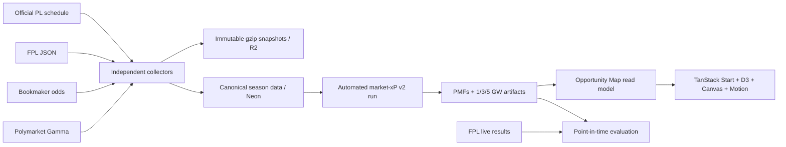

# FPL Opportunity Map: technical implementation and design specification

- **Status:** implemented vertical slice
- **Season target:** Premier League / FPL 2026/27
- **Application:** `apps/fpl`, deployed independently at `fpl.wasimarif.com`
- **Backend package:** `packages/market-intelligence`
- **Last updated:** 17 July 2026

## Product outcome

The Opportunity Map turns fixture markets, FPL observations, availability, price, and ownership into a multi-gameweek player-points distribution. It is deliberately an exploration tool rather than an “edge” claim: uncertainty, source coverage, data cut-off, rules version, and immutable input batches remain visible.

The same route works through the season transition:

1. before the new FPL player list exists, it serves a named and visibly estimated pre-launch scenario;
2. the collector refuses to relabel a prior-season FPL response as 2026/27;
3. as soon as the current player list is captured, the automated forecast job writes the `live` dataset;
4. the server selects the newest live three-gameweek snapshot automatically, without a deployment;
5. official and unavailable prices use different discriminated states, so a missing price is never silently coerced to zero or an estimate.

## System boundaries



The client never receives credentials or raw provider payloads. R2 is the durable evidence archive; Neon contains canonical entities, references, compact observations, immutable model runs, result rows, and serving snapshots.

## Season and identity model

The season is a first-class namespace, not a label attached at read time. A manifest defines its lifecycle, price-publication state, ruleset, 20 season teams, 380 fixtures, deadlines, and current gameweek assignments.

- Lifecycle is monotonic: `planned → prelaunch → active → complete → archived`.
- Price state is monotonic: `unpublished → partial → official`.
- Fixture identity is season + home club + away club; the mutable gameweek and kickoff assignment has effective dates.
- Provider fixture IDs win when already linked. Otherwise, exact canonical teams plus a kickoff tolerance are required. Ambiguous/unmatched events are quarantined.
- Player identity prefers Opta code, then stable FPL code, then a season-scoped provisional key. A separate registration joins that person to a team and position for one season.
- Every snapshot identifies a dataset. The pre-launch scenario and the archived 2025/26 room can never be returned as live data accidentally.

The official 2026/27 fixture article is parsed into 38 complete rounds. A parser fixture protects the HTML interpretation, and import history preserves later postponements or gameweek changes.

## Collection and storage

The scheduled GitHub Actions job runs every five minutes; source-specific deterministic slots prevent duplicate work:

| Source                   |          Normal cadence | Inside 48 hours | Behaviour                                                                                       |
| ------------------------ | ----------------------: | --------------: | ----------------------------------------------------------------------------------------------- |
| Premier League schedule  |                   daily |         6 hours | re-imports assignments without downgrading season state                                         |
| FPL bootstrap + fixtures |              60 minutes |      15 minutes | validates season dates/teams, registers players, promotes price/lifecycle state                 |
| The Odds API             |              30 minutes |       5 minutes | captures all EPL events, reconciles to the official season, retains unmatched annotations       |
| Polymarket               |              30 minutes |       5 minutes | captures public football probabilities; currently research-only until exact fixture links exist |
| FPL live results         | 10 minutes while active |             n/a | becomes daily after the final fixture and never downgrades a final result                       |

Each source is one independently claimed attempt. A missing odds key or a provider failure records a failed source attempt but does not prevent schedule, FPL, or Polymarket capture. The complete raw response is JSON-serialised, gzip-compressed, addressed by SHA-256, and stored once in R2. Neon stores the object key, checksum, sizes, encoding, and the parsed canonical rows. URLs and recorded errors redact credentials.

## Automated forecast contract

`forecast:auto` closes the production loop after every collection tick:

1. select the newest current-season batch for each source at or before the cut-off;
2. load active player registrations and the exact upcoming fixture horizon;
3. de-vig each bookmaker's 1X2 and 2.5-ish totals market independently;
4. estimate home/away Poisson goal rates and source agreement;
5. combine FPL per-90 observations with position priors, shrinking small samples over the first 450 minutes;
6. keep current price and ownership as explicit `unpublished`, `provisional`, or `official` states;
7. score discrete fixture outcomes with the versioned FPL ruleset;
8. convolve fixture PMFs for blanks, normal weeks, and doubles across a 1, 3, or 5 week horizon;
9. persist exact fixture PMFs, player quantiles, haul probability, expected points, source coverage, input-batch lineage, code version, and up to 12 prior trail points;
10. derive a deterministic run ID from source batches and code version, making repeated workflow ticks idempotent.

The rules engine covers appearance, position-specific goals, assists, clean sheets, goalkeeper saves/penalty saves, goals conceded, defensive contributions, bonus, cards, own goals, and missed penalties. Captures now retain the FPL per-90 fields required for player scoring. Position priors keep the model operational during August's zero-minute sample, while the UI makes low market coverage and provisional inputs explicit.

This TypeScript model is an intentionally auditable baseline. It provides the point-in-time archive and evaluation substrate needed before a more highly calibrated Python or Bayesian model can be justified.

## Evaluation

The result job writes provisional then final player-gameweek results. Evaluation selects the latest eligible horizon-one forecast before the gameweek deadline and records:

- mean absolute error;
- root mean squared error;
- interval coverage;
- haul-probability Brier score.

No observation captured or published after a model cut-off is accepted. This is the principal leakage guard and makes later FPL-only versus market-informed ablations reproducible.

## Interface specification

### Information hierarchy

1. **Season/status hero:** season, lifecycle, current data mode, players modelled, and aggregate source coverage.
2. **Data availability notice:** copy changes for unpublished, partial, and official price states; source health expands in place.
3. **Analysis controls:** Forecast, Value, and Opportunity modes plus search and explicit map/list controls.
4. **Primary view:** a dense spatial overview on desktop and a semantic ranked list by default on small screens.
5. **Filters and time:** position, team, maximum price, 60-minute probability, scenario, and three-snapshot replay.
6. **Player inspector:** distribution, gameweek shape, coverage/agreement, exact cut-off and model provenance.
7. **Compare tray:** up to three pinned players, preserved in the URL.

All meaningful exploration state is URL-serialised: mode, view, scenario, filters, player, compare set, and replay index. Refresh/back/forward and shareable links therefore reproduce the decision state.

### Visual encodings

| Mode        | X                         | Y                              | Point / halo                                                   |
| ----------- | ------------------------- | ------------------------------ | -------------------------------------------------------------- |
| Forecast    | multiweek expected points | haul probability               | point size = upside; halo = uncertainty/agreement              |
| Value       | expected points per £m    | expected points                | unavailable prices remain unavailable                          |
| Opportunity | expected points per £m    | ownership rank − forecast rank | positive values imply under-ownership relative to the forecast |

D3 owns domains, scales, axes, and ticks. Canvas renders the dense halos and marks; an overlaid SVG supplies axes and keyboard-focusable hit targets. Exact values, sorting, and the complete decision path remain available in DOM list/inspector content. Depth is not used to rank players.

### Responsive behaviour

- At desktop widths the map and inspector form the primary two-column work surface.
- `view=auto` resolves to the semantic list on narrow screens; the user may still request the map.
- Controls wrap into touch-sized rows, the display headline scales without horizontal overflow, and secondary scenario controls are reduced before core filters.
- The archived Deadline Intelligence Room remains reachable at `/archive/2025-26/gw34`; `/` redirects to `/opportunities`.

### Motion specification

Motion communicates state changes rather than running decoratively:

- point/filter changes use spring continuity so a player retains object identity between modes;
- inspector entry/exit combines short opacity and translated-position transitions;
- the replay control advances every 1.4 seconds only after an explicit Play action;
- comparison and selection use restrained highlight/scale feedback;
- no infinite render loop is used, and Canvas redraws only for data/state changes;
- `prefers-reduced-motion` removes spring movement, disables replay playback, and preserves direct state changes.

Target timing is 160–220 ms for control feedback and 240–360 ms for spatial transitions. Springs should be interruptible and avoid overshoot large enough to corrupt perceived chart position.

### Accessibility

- Native buttons, inputs, selects, labels, details/summary, and `aria-pressed` expose control state.
- SVG hit targets are keyboard reachable and labelled with player plus values.
- The list is the equivalent exact reading path for the Canvas plot.
- Focus is visible, source status is communicated with text/icons as well as colour, and contrast is checked in both desktop and mobile layouts.
- The interface has no page-level horizontal overflow at 390 px.
- Reduced-motion behaviour is functional, not merely cosmetic.

## Success criteria and evidence

| Criterion                                                 | Implementation evidence                                                                                                            |
| --------------------------------------------------------- | ---------------------------------------------------------------------------------------------------------------------------------- |
| Old-season data can never masquerade as 2026/27           | season guard checks deadline range and at least 80% of expected teams; failing captures are recorded and isolated                  |
| Fixture/team/player joins remain season-safe              | season-scoped manifests, durable person identity, registrations, provider links, assignment history, and reconciliation quarantine |
| Price publication does not require a redesign             | discriminated price/ownership states and lifecycle-aware UI copy; the route automatically selects live data when available         |
| Collection survives restarts and partial provider failure | deterministic slots, unique attempt claims, content-addressed R2 objects, additive Neon persistence, per-source isolation          |
| A forecast can be reproduced exactly                      | immutable run ID/config hash, input batch foreign keys, cut-off enforcement, rules/model/code versions, persisted fixture PMFs     |
| Blanks and doubles are modelled rather than patched in UI | forecasts are generated per exact fixture and convolved by gameweek/horizon                                                        |
| Uncertainty and source quality are visible                | P10/P50/P90, haul probability, market coverage, agreement, source health and provenance appear in the read model/inspector         |
| Exploration is useful on pointer, keyboard, and mobile    | Canvas + SVG hit layer, equivalent list, URL state, compare tray, semantic controls, reduced motion, responsive layouts            |
| Forecast quality can be falsified                         | final results plus deadline-safe MAE/RMSE/coverage/Brier evaluation are persisted                                                  |
| Pre-launch remains honest and useful                      | explicit named scenario with estimated price bands; no fallback from a missing live query to the archived season                   |

Automated tests cover source schemas, season rejection, reconciliation, scheduling policy, object-store deduplication, partial failures, rules scoring, forecast PMFs, blank/double convolution, leakage, run immutability, evaluation, and read-model state changes. Production builds and browser checks cover routing, URL interactions, selection/comparison, mobile overflow, console errors, and automated accessibility scans.

## Operations

Required deployment secrets for the collector are `DATABASE_URL`, `THE_ODDS_API_KEY`, `CLOUDFLARE_ACCOUNT_ID`, `R2_BUCKET`, `R2_ACCESS_KEY_ID`, and `R2_SECRET_ACCESS_KEY`. The Vercel app only needs `DATABASE_URL` for live reads; its bundled pre-launch scenario works without a database in local development.

Primary commands:

```text
vp run market-intelligence#db:migrate
vp run market-intelligence#season:sync
vp run market-intelligence#collector:tick
vp run market-intelligence#forecast:auto
vp run market-intelligence#capture:results
vp run market-intelligence#evaluate
```

The migration is additive. Existing 2025/26 data is isolated into its named demo/archive dataset, and the pre-launch snapshot is also persisted in Neon so deployed reads and bundled fallback render the same contract.

## Next experiment boundary

The next project should expand this foundation rather than create another ingestion stack. The strongest follow-on is the Transfer Multiverse: it can reuse the fixture PMFs, player distributions, season rules, URL-state conventions, and evaluation archive while adding squad constraints and paired simulations. Before labelling any forecast difference an “edge,” collect enough deadlines to compare market-informed, FPL-only, and naive fixture baselines out of sample.
